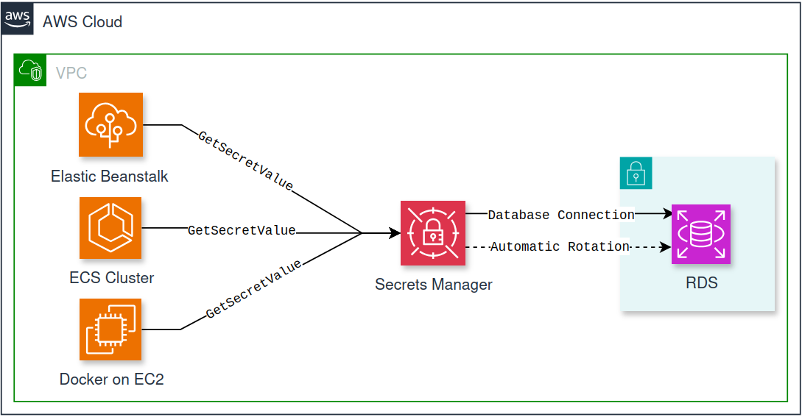
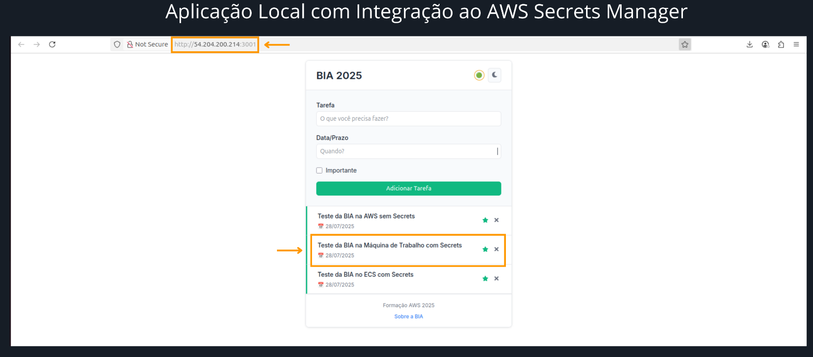
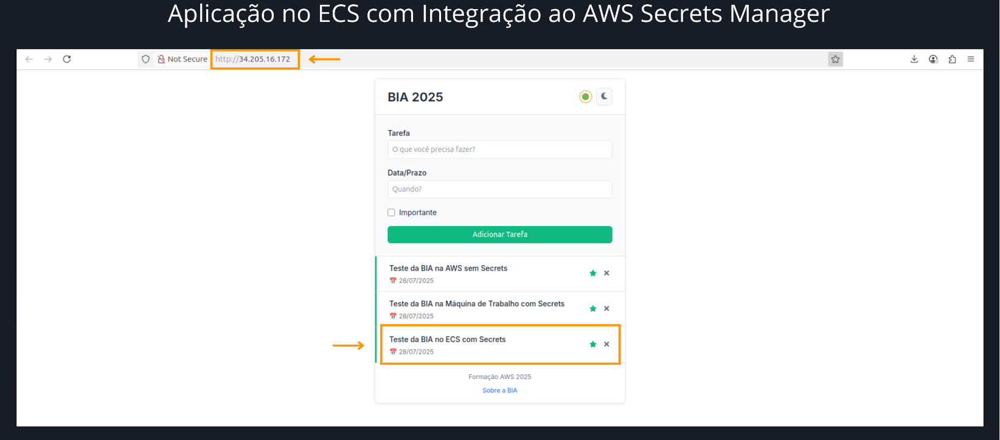
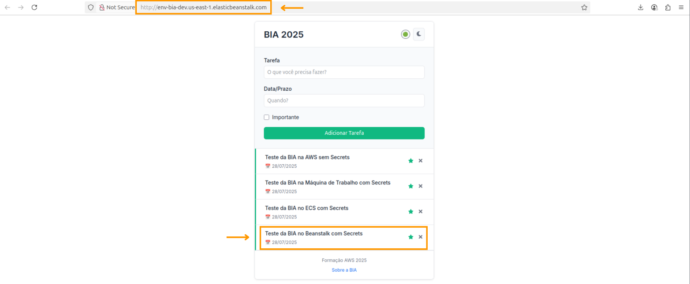
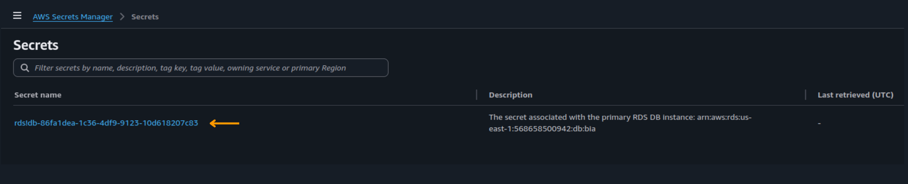
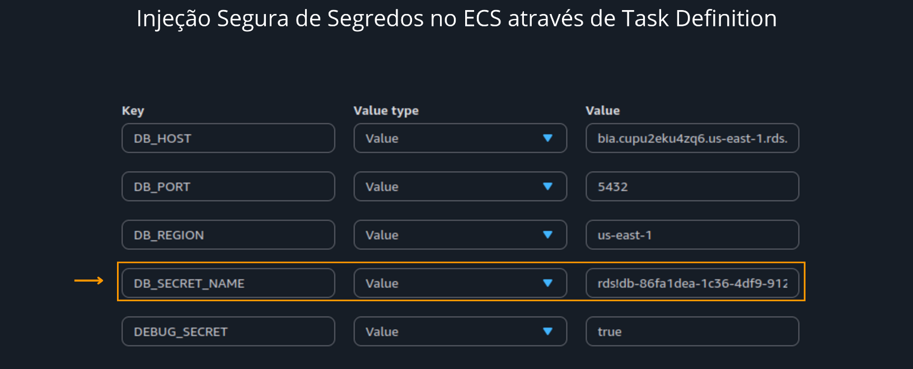
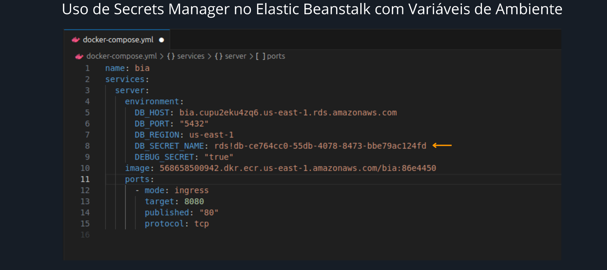
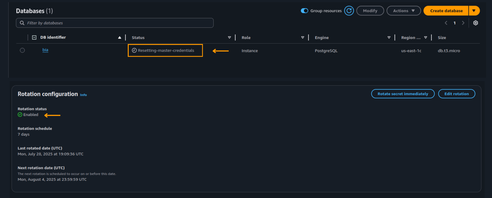

# 🔐 Gestão Segura de Credenciais com AWS Secrets Manager

Este repositório apresenta a implementação prática de uma solução avançada para **gestão segura de credenciais** em ambientes de computação em nuvem.

---

## ✅ Objetivo do Projeto

O principal objetivo deste projeto é demonstrar a aplicação de boas práticas de segurança na nuvem por meio do uso do **AWS Secrets Manager** para o gerenciamento centralizado de segredos e a rotação automática de credenciais. A proposta visa garantir conformidade com padrões de segurança e mitigar riscos associados à exposição de informações sensíveis em ambientes distribuídos.

A solução estabelece uma **arquitetura segura e escalável** para aplicações cloud-native, substituindo credenciais estáticas por mecanismos seguros de obtenção dinâmica de segredos e automatizando a rotação de senhas no **Amazon RDS**, promovendo maior governança, rastreabilidade e resiliência operacional.

---

## 🧱 Arquitetura da Solução

A solução foi aplicada em três ambientes distintos, representando cenários reais de deployment:

- **Aplicações containerizadas:** utilizando Amazon ECS (Elastic Container Service)  
- **Aplicações gerenciadas:** utilizando AWS Elastic Beanstalk  
- **Ambiente local para desenvolvimento e testes:** utilizando Docker

Diagrama da arquitetura:

---

## 🛠️ Serviços AWS Utilizados

| Serviço               | Descrição                                               |
|-----------------------|---------------------------------------------------------|
| **AWS Secrets Manager**| Serviço de gerenciamento seguro e rotação automatizada de segredos  |
| **Amazon RDS**         | Banco de dados relacional com suporte à rotação automática de credenciais  |
| **Amazon ECS**         | Plataforma para orquestração e gerenciamento de containers Docker  |
| **AWS Elastic Beanstalk** | Plataforma PaaS para deployment eO objetivo principal é demonstrar a utilização do AWS Secrets Manager para o gerenciamento centralizado e a rotação automática de credenciais, assegurando a conformidade e mitigando riscos relaciona gerenciamento de aplicações web  |
| **Docker**             | Ambiente de containerização local para desenvolvimento e testes  |

---

## 🔎 Cenários Desenvolvidos

### 1️⃣ Integração com Amazon ECS

**Descrição:**  
Desenvolvimento e deployment de aplicação containerizada que consome credenciais de forma dinâmica do AWS Secrets Manager, operando em cluster ECS.

**Fluxo de operação:**  
- Recuperação segura e dinâmica de credenciais via AWS SDK  
- Utilização da rotação automática de senhas no Amazon RDS  
- Deploy contínuo e gerenciamento da aplicação no ECS

### 2️⃣ Deploy com AWS Elastic Beanstalk

**Descrição:**  
Deploy de aplicação web utilizando AWS Elastic Beanstalk, com integração segura para consumo de segredos gerenciados pelo AWS Secrets Manager.

**Fluxo de operação:**  
- Leitura dinâmica dos segredos via AWS Secrets Manager  
- Deploy gerenciado, escalável e seguro com suporte a rotação automática de credenciais

### 3️⃣ Ambiente Local com Docker
O objetivo principal é demonstrar a utilização do AWS Secrets Manager para o gerenciamento centralizado e a rotação automática de credenciais, assegurando a conformidade e mitigando riscos relaciona
**Descrição:**  
Execução da aplicação em ambiente Docker local para fins de desenvolvimento e testes, integrando o consumo seguro de segredos via AWS Secrets Manager.

---

## 🧠 Principais Aprendizados

- Aplicação prática do AWS Secrets Manager para gestão segura de credenciais  
- Implementação de rotação automatizada de senhas no Amazon RDS  
- Integração robusta e segura da aplicação com múltiplos ambientes de deployment  
- Consolidação das melhores práticas e padrões de segurança para aplicações em nuvem  

---

## 📸 Galeria de Capturas

### Aplicação Local com Integração ao AWS Secrets Manager
 

### Aplicação no ECS com Integração ao AWS Secrets Manager
 

### Aplicação no Elastic Beanstalk com Integração ao AWS Secrets Manager
 

### Criação de Segredo no AWS Secrets Manager para Acesso ao RDS
 

### Injeção Segura de Segredos no ECS através de Task Definition
 

### Uso de Secrets Manager no Elastic Beanstalk com Variáveis de Ambiente
 

### Rotação Automática no Amazon RDS 
 

---

## ✅ Considerações Finais

Este projeto proporcionou uma experiência prática essencial para o fortalecimento do conhecimento em gestão segura de credenciais na nuvem, destacando a importância da automação e da adoção de padrões elevados de segurança no desenvolvimento de aplicações distribuídas.

---

📎 **LinkedIn:** https://www.linkedin.com/in/aryane-andrade  
